# Design Document

This document describes the architecture, patterns, and data flows of the DITA ETL pipeline.

---

## 1. System context

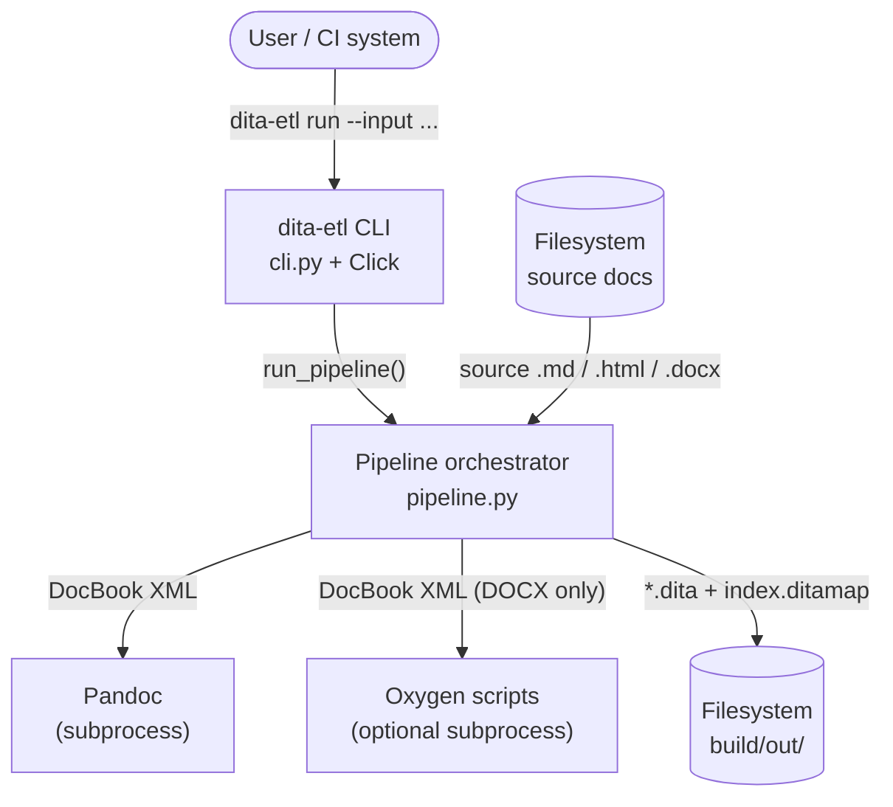

---

## 2. Pipeline stage flow

The pipeline is composed of four sequential stages. Every stage boundary
is crossed through a **typed, immutable contract dataclass**.

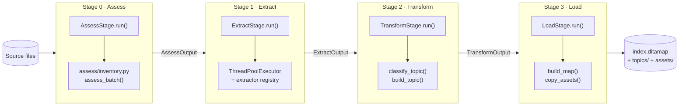

---

## 3. Stage contracts (class diagram)

All contracts are `@dataclass(frozen=True)` with `__post_init__` validation.

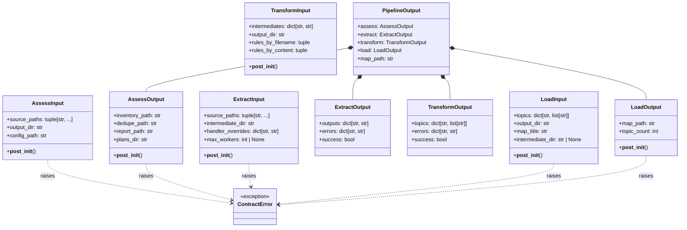

---

## 4. Layered architecture

The codebase is split into a **functional core** (pure functions, no I/O) and an **imperative shell** (stages, orchestrator, CLI) that handles all side effects.

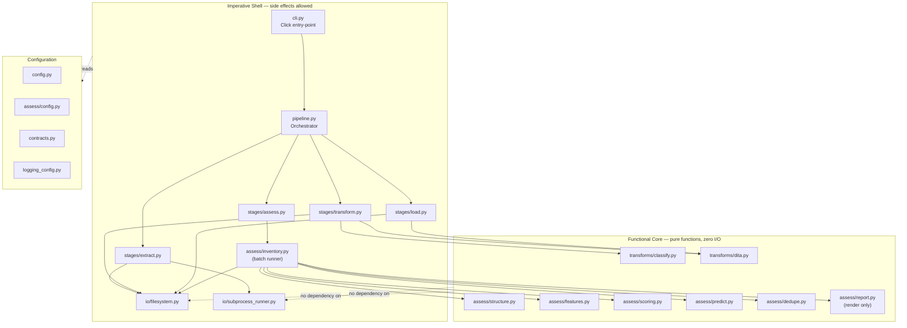

---

## 5. Full pipeline sequence

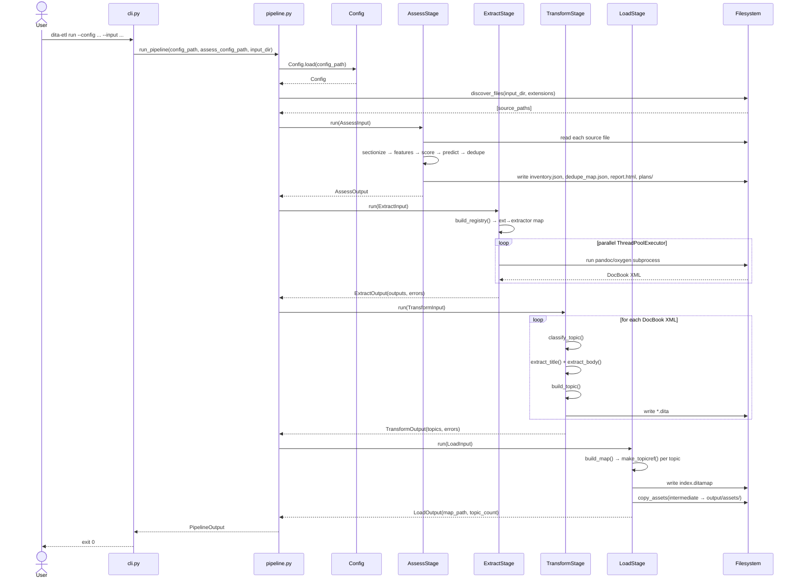

---

## 6. Assess sub-pipeline

Stage 0 runs a full analysis sub-pipeline on the source files before any conversion happens.

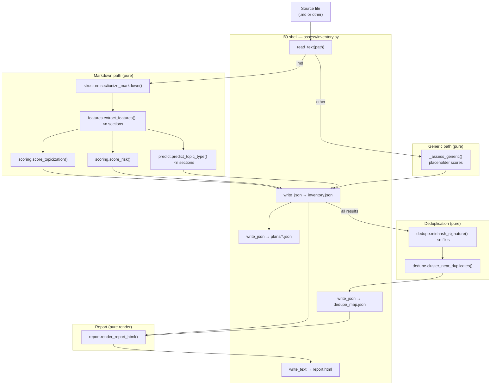

---

## 7. Extract stage — Strategy + Factory

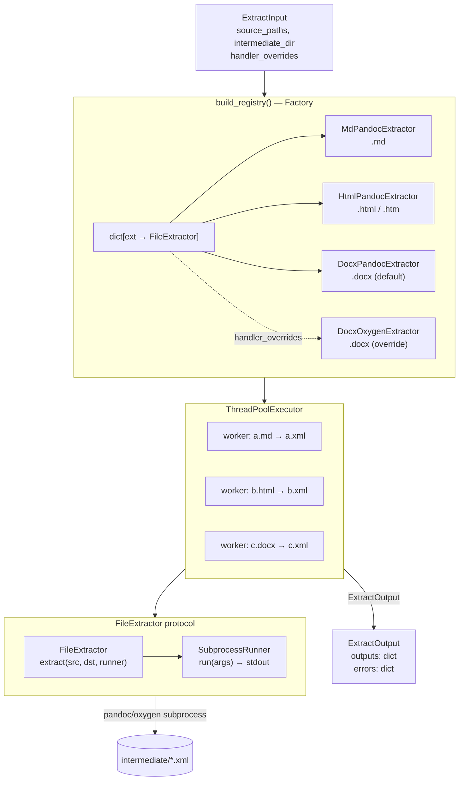

---

## 8. Transform data flow

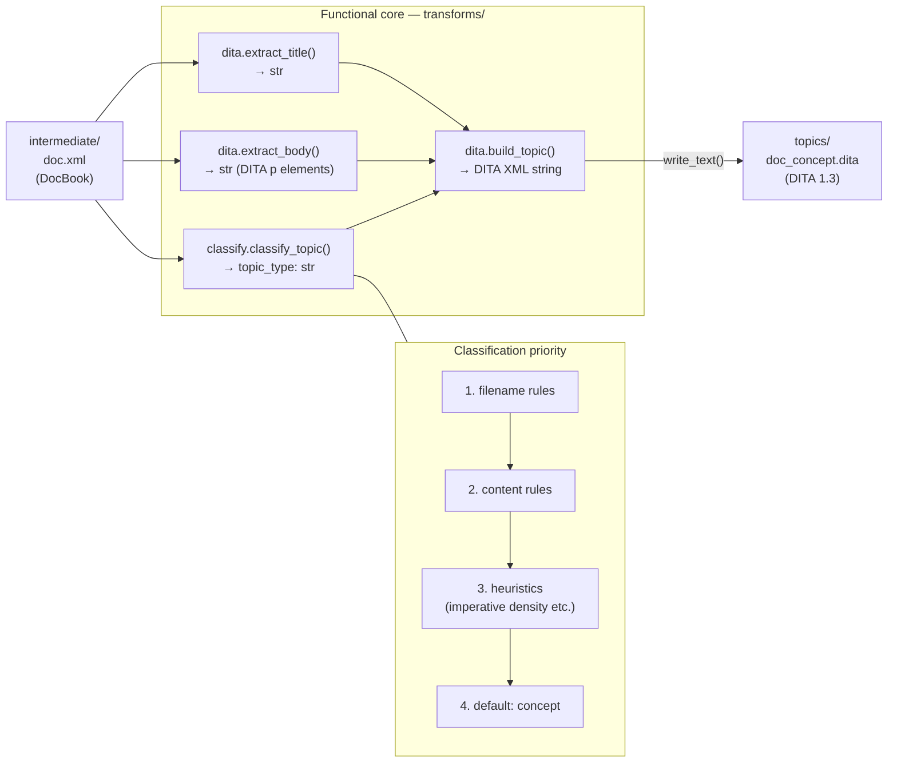

---

## 9. Load assembly

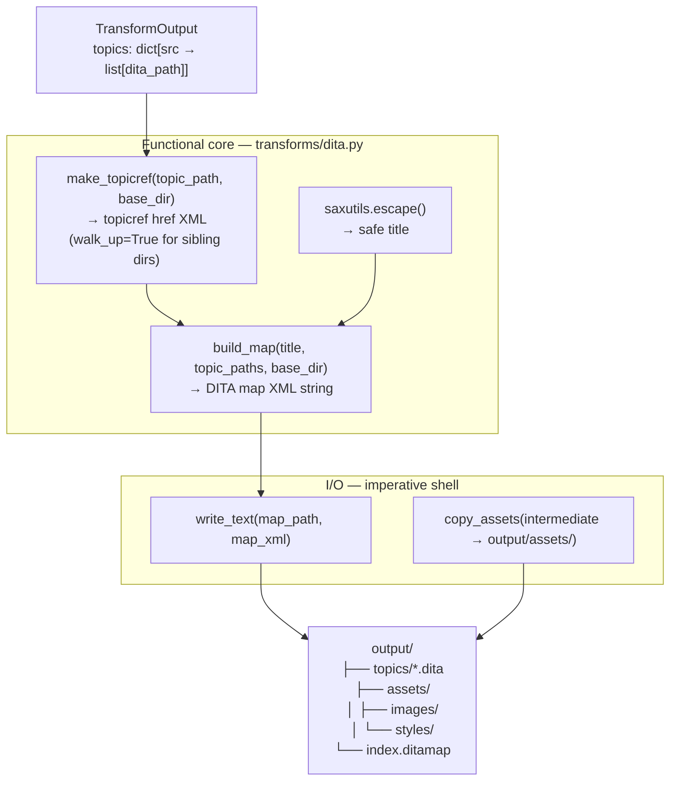

---

## 10. Module dependency graph

Arrows point from importer to importee. Modules in the functional core have
**no arrows** pointing to `io/`.

```mermaid
graph TD
    CLI["cli.py"] --> PL["pipeline.py"]
    PL --> CFG["config.py"]
    PL --> CTR["contracts.py"]
    PL --> LOG["logging_config.py"]
    PL --> IOF["io/filesystem.py"]

    PL --> SA["stages/assess.py"]
    PL --> SE["stages/extract.py"]
    PL --> ST["stages/transform.py"]
    PL --> SL["stages/load.py"]

    SA --> INV["assess/inventory.py"]
    SA --> CTR

    INV --> STR["assess/structure.py 🟢"]
    INV --> FT["assess/features.py 🟢"]
    INV --> SC["assess/scoring.py 🟢"]
    INV --> PR["assess/predict.py 🟢"]
    INV --> DD["assess/dedupe.py 🟢"]
    INV --> RPT["assess/report.py 🟢"]
    INV --> ACFG["assess/config.py"]
    INV --> IOF

    SE --> REG["extractors/registry.py"]
    SE --> IOR["io/subprocess_runner.py"]
    SE --> IOF
    SE --> CTR

    REG --> MD["extractors/md_pandoc.py"]
    REG --> HTML["extractors/html_pandoc.py"]
    REG --> DOCXP["extractors/docx_pandoc.py"]
    REG --> DOCXO["extractors/docx_oxygen.py"]

    ST --> CL["transforms/classify.py 🟢"]
    ST --> DT["transforms/dita.py 🟢"]
    ST --> IOF
    ST --> CTR

    SL --> DT
    SL --> IOF
    SL --> CTR

    classDef pure fill:#d4edda,stroke:#28a745,color:#155724
    class STR,FT,SC,PR,DD,RPT,CL,DT pure
```

> 🟢 = pure function module (no `io/` imports, no side effects)

---

## 11. Source file lifecycle

State transitions for a single source file as it moves through the pipeline.

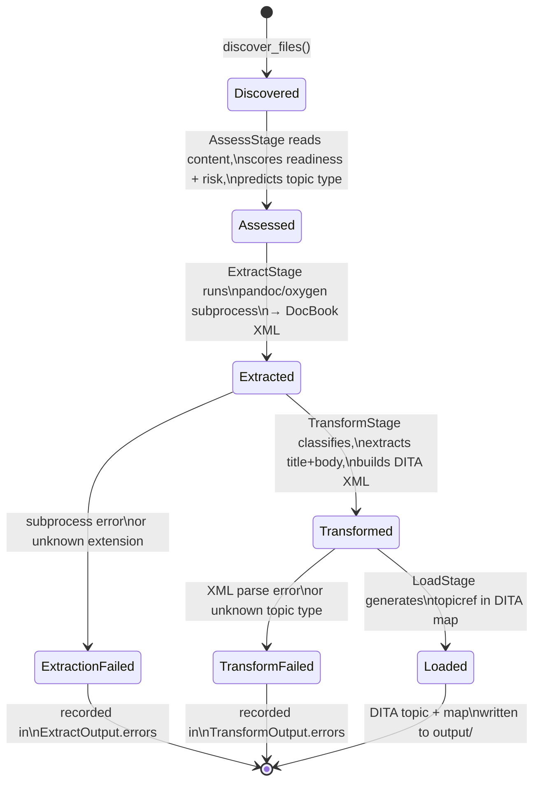

---

## 12. Architectural patterns

### Functional core + imperative shell

All business logic (classification, scoring, XML construction, deduplication)
lives in **pure functions** that take data in and return data out — no
filesystem access, no subprocess calls, no global state. The "shell" (CLI,
pipeline orchestrator, stage `run()` methods) handles I/O and wires pure
functions together.

| Layer | Modules | Constraint |
|---|---|---|
| Functional core | `transforms/`, `assess/structure.py`, `assess/features.py`, `assess/scoring.py`, `assess/predict.py`, `assess/dedupe.py`, `assess/report.py` | No imports from `io/` |
| Imperative shell | `cli.py`, `pipeline.py`, `stages/`, `assess/inventory.py` | May call `io/` |
| I/O boundary | `io/filesystem.py`, `io/subprocess_runner.py` | Only place `os`, `shutil`, `subprocess` are used |

**Benefits:** Pure functions are trivially unit-tested without mocking. The
functional core is portable to async or distributed runtimes without changes.

---

### Typed stage contracts

Every stage boundary is crossed using a frozen `@dataclass` with `__post_init__`
validation. Stages only accept and return these contracts — no loose `dict`,
no `**kwargs`.

**Benefits:** Contracts make implicit assumptions explicit at construction time.
Immutability (`frozen=True`) prevents accidental mutation across stage boundaries.
Type checkers (mypy) can verify the full pipeline end-to-end.

---

### Strategy pattern — format extractors

Each source format is handled by a separate class (`MdPandocExtractor`,
`HtmlPandocExtractor`, `DocxPandocExtractor`, `DocxOxygenExtractor`) that
satisfies the `FileExtractor` protocol. `ExtractStage` selects the correct
strategy at runtime via the registry.

**Benefits:** New formats can be added without touching `ExtractStage`. The
Oxygen and Pandoc DOCX extractors can be swapped via `handler_overrides`
config without code changes.

---

### Factory pattern — extractor registry

`build_registry()` is a factory function that constructs the
`extension → extractor` mapping from configuration at pipeline startup. It
encapsulates creation logic and applies caller-supplied overrides.

**Benefits:** Decouples stage construction from the registry's internal
structure. Config-driven overrides require no code changes.

---

### Protocol-based duck typing

`SubprocessRunner` satisfies the `Runner` protocol. Tests inject a
`RecordingRunner` that records calls without spawning real processes. No
monkey-patching of stdlib required in extractor tests.

---

## 13. Trade-offs

| Decision | Alternative considered | Rationale |
|---|---|---|
| Plain `dataclass` contracts | Pydantic models | Avoids a runtime dependency; stdlib validation is sufficient |
| `Protocol`-based runner | ABC inheritance | Duck typing is more composable; avoids import coupling |
| Thread pool in `ExtractStage` | `asyncio` | Pandoc calls are subprocess-bound, not coroutine-friendly; threads are simpler |
| Click CLI | argparse | Composable command groups, auto-help, better testability |
| Removed Prefect | Prefect / Airflow | Removes a heavy optional dependency; four sequential stages do not require a workflow engine |
| Separate `transforms/` module | Inline logic in stages | Enables direct unit testing of transformation logic without any I/O setup |
| `walk_up=True` in `make_topicref` | Require topics inside map dir | DITA maps legitimately reference topics in sibling directories; `walk_up` produces valid relative hrefs |
