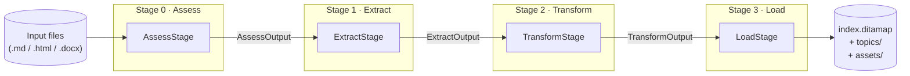
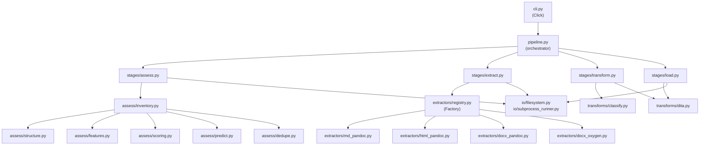
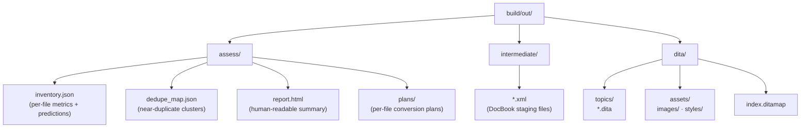

# DITA ETL Pipeline

A composable, pure-Python pipeline for converting mixed-format source documents
(Markdown, HTML, DOCX) into structured DITA 1.3 XML.

No Prefect. No heavy frameworks. Four orthogonal stages composed through
typed contracts, with a functional core and a thin imperative shell.

---

## Architecture overview



Each arrow is a **typed, validated frozen dataclass** (`contracts.py`). Stages are
stateless classes with a single `run(input_) -> output` method.

### Module dependency



---

## Installation

```bash
git clone https://github.com/your-org/ETL-POC.git
cd ETL-POC

python3 -m venv .venv
source .venv/bin/activate          # Windows: .venv\Scripts\activate

pip install -e ".[dev]"
```

### Prerequisites

| Tool   | Purpose                       | Required? |
|--------|-------------------------------|-----------|
| Pandoc | Markdown / HTML / DOCX → DocBook | Yes    |
| Oxygen | Alternative DOCX extractor    | Optional  |

Install Pandoc via `brew install pandoc` (macOS) or from [pandoc.org](https://pandoc.org).

---

## Quick start

```bash
# Full pipeline (Assess → Extract → Transform → Load)
dita-etl run \
  --config config/config.yaml \
  --assess-config config/assess.yaml \
  --input sample_data/input/

# Assessment only (no DITA output)
dita-etl assess \
  --config config/config.yaml \
  --assess-config config/assess.yaml \
  --input sample_data/input/

# Increase log verbosity
dita-etl --log-level DEBUG run --input sample_data/input/
```

---

## Project structure

```
ETL-POC/
├── dita_etl/
│   ├── cli.py                  # Click CLI (imperative shell)
│   ├── config.py               # Config dataclasses + YAML loader
│   ├── contracts.py            # Stage I/O typed contracts
│   ├── logging_config.py       # Structured logging setup
│   ├── pipeline.py             # Orchestrator (imperative shell)
│   │
│   ├── assess/                 # Assessment sub-pipeline (pure functions)
│   │   ├── config.py
│   │   ├── dedupe.py           # MinHash near-duplicate detection
│   │   ├── features.py         # Section feature extraction
│   │   ├── inventory.py        # Batch runner (imperative shell)
│   │   ├── predict.py          # Topic-type prediction
│   │   ├── report.py           # HTML report rendering
│   │   ├── scoring.py          # Readiness + risk scoring
│   │   └── structure.py        # Markdown sectionization
│   │
│   ├── extractors/             # Strategy: format → DocBook converters
│   │   ├── base.py             # FileExtractor protocol
│   │   ├── docx_oxygen.py
│   │   ├── docx_pandoc.py
│   │   ├── html_pandoc.py
│   │   ├── md_pandoc.py
│   │   └── registry.py         # Factory: extension → extractor map
│   │
│   ├── io/                     # I/O isolation layer
│   │   ├── filesystem.py       # File R/W, hashing, discovery, asset copy
│   │   └── subprocess_runner.py
│   │
│   ├── stages/                 # Pipeline stages (imperative shell)
│   │   ├── assess.py
│   │   ├── extract.py
│   │   ├── load.py
│   │   └── transform.py
│   │
│   └── transforms/             # Functional core (pure functions)
│       ├── classify.py         # DITA topic-type classifier
│       └── dita.py             # DITA XML builders
│
├── tests/
│   ├── unit/                   # Per-module unit tests
│   └── integration/            # End-to-end stage wiring tests
│
├── config/
│   ├── config.yaml             # Main pipeline config
│   └── assess.yaml             # Assessment config
│
├── docs/                       # MkDocs source
├── mkdocs.yml
├── pyproject.toml
└── requirements.txt
```

---

## Configuration

### `config/config.yaml`

```yaml
tooling:
  pandoc_path: /usr/local/bin/pandoc

source_formats:
  treat_as_html: [".html", ".htm"]
  treat_as_markdown: [".md"]

dita_output:
  output_folder: build/out
  map_title: "My Documentation Set"

classification_rules:
  by_filename:
    - match: "guide"
      type: "task"
    - match: "index"
      type: "concept"
  by_content:
    - match: "procedure"
      type: "task"
```

### `config/assess.yaml`

```yaml
shingling:
  ngram: 7
  minhash_num_perm: 64
  threshold: 0.88

scoring:
  topicization_weights:
    heading_ladder_valid: 10
    avg_section_len_target: 15
  risk_weights:
    deep_nesting: 20
    complex_tables: 25

limits:
  target_section_tokens: [50, 500]
```

---

## Output artefacts



---

## Running tests

```bash
pytest                           # all tests with coverage report
pytest tests/unit/               # unit tests only
pytest tests/integration/        # integration tests only
pytest --cov-report=html         # open htmlcov/index.html
```

Coverage threshold: **90%** (enforced by pytest-cov, currently ~93%).

---

## Extending the pipeline

### Adding a new extractor

1. Create `dita_etl/extractors/my_format.py` implementing the `FileExtractor` protocol.
2. Register it in `dita_etl/extractors/registry.py` (`default_handlers` or `name_map`).
3. Add unit tests in `tests/unit/test_extractors.py`.

### Adding a new stage

1. Define input/output contracts in `dita_etl/contracts.py`.
2. Implement the stage in `dita_etl/stages/my_stage.py` — one `run(input_) -> output` method.
3. Wire it into `dita_etl/pipeline.py`.

---

## Building the documentation

```bash
pip install -e ".[docs]"
mkdocs serve          # live preview at http://127.0.0.1:8000
mkdocs build          # static site → site/
```
