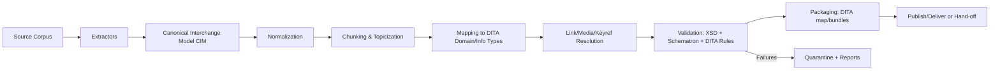

# Content-to-DITA ETL: Vendor-Neutral, Modular Architecture

## 0) Principles
- **Isolate concerns**: each stage does one job, I/O is explicit, and artifacts are immutable.
- **Contracts over tools**: components communicate via documented schemas, not library quirks.
- **Deterministic**: same inputs, same outputs. Hash every step.
- **Config-first**: mappings, taxonomies, chunk rules, and output flavors live in versioned YAML/JSON.
- **Graceful degradation**: partial extractions don’t block the whole run; quarantine bad records.
- **Testable**: every stage has fixtures and golden files.

---

## 1) Pipeline Overview



---

## 2) Data Contracts (the glue that keeps this sane)

### 2.1 Canonical Interchange Model (CIM)
A minimal, tool-neutral JSON structure every extractor must emit.

```json
{
  "doc_id": "stable-id",
  "source_meta": {"path": "…", "format": "md|docx|html|pdf|…", "mtime": "…"},
  "title": "string",
  "blocks": [
    {"type":"heading","level":2,"text":"...","id":"..."},
    {"type":"para","text":"..."},
    {"type":"list","ordered":false,"items":["...","..."]},
    {"type":"code","lang":"python","text":"..."},
    {"type":"table","rows":[["H1","H2"],["v1","v2"]]},
    {"type":"xref","target":"relative-or-absolute","text":"..."},
    {"type":"image","src":"uri-or-blob-ref","alt":"...","caption":"..."}
  ],
  "taxa": ["concept:x", "product:y"], 
  "front_matter": {"author":"...", "keywords":["..."], "abstract":"..."}
}
```

### 2.2 Normalized Topic Model (NTM)
After normalization and before DITA mapping:

```json
{
  "doc_id":"stable-id",
  "language":"en",
  "topics":[
    {
      "topic_id":"t-001",
      "topic_role":"concept|task|reference|generic",
      "title":"…",
      "prolog": {"keywords":["…"], "audience":["…"], "product":["…"]},
      "body":[ /* block list like CIM, but cleaned */ ],
      "relations":[
        {"rel":"xref","target_id":"t-002","text":"See also …"},
        {"rel":"media","path":"media/fig-1.png","alt":"…"}
      ]
    }
  ],
  "keys":[ {"key":"prodA", "href":"topics/prodA.dita"} ]
}
```

---

## 3) Stages and Responsibilities

### 3.1 Extractors (ingest anything)
- **Responsibility**: parse native format into CIM.
- **Adapters**: md, docx, html, pdf+OCR, gdocs export, pptx, Confluence export, bespoke CMS dumps.
- **Rules**:
  - Never guess structure beyond what’s present. Don’t invent headings from bold text unless configured.
  - Emit unparsed residues to `blocks:[{type:"raw", format:"...", data:"..."}]` for later handling.

**Extractor Interface (pseudocode)**:
```python
class Extractor:
    def sniff(self, path_or_bytes) -> bool: ...
    def extract(self, path_or_bytes, cfg) -> CIM: ...
```

### 3.2 Normalization
- **Tasks**: canonicalize whitespace, fix heading levels, unwrap hard line breaks, standardize tables, resolve relative links, unify code blocks, detect languages.
- **I/O**: CIM in, NTM out.
- **Enforce**:
  - Unique stable IDs for blocks and prospective topics.
  - Language tags (BCP 47).
  - Taxonomy normalization to SKOS/URIs if provided.

### 3.3 Chunking & Topicization
- **Goal**: split content into DITA-sized atomic topics using deterministic rules.
- **Strategies** (configurable):
  - By heading depth
  - By semantic cues (procedure, prerequisites, parameters)
  - By token budget (useful for RAG later, but remain DITA-compliant)
- **Output**: NTM with topic boundaries and suggested topic types.

**Example rules (YAML)**:
```yaml
chunking:
  by_heading_levels: [1,2]
  min_topic_tokens: 120
  max_topic_tokens: 1200
  prefer_semantic_cues: true
topic_typing:
  heuristics:
    - if_contains: ["Steps:", "Procedure"] -> task
    - if_tables_over: 2 -> reference
    - default: concept
```

### 3.4 Mapping to DITA
- **Responsibility**: map NTM blocks to DITA elements and info types.
- **Mechanics**:
  - `topic_role` drives shell selection: `<concept>`, `<task>`, `<reference>` or `<topic>`.
  - Map lists, code, tables, images into legal DITA structures.
  - Map metadata into `<prolog>`: `<keywords>`, `<audience>`, `<prodinfo>`, `<resourceid>`, etc.
  - Generate `@id` consistently; avoid collisions.

**Mapping config (YAML)**:
```yaml
dita:
  shells:
    concept: "concept"
    task: "task"
    reference: "reference"
  metadata:
    keywords_from: ["front_matter.keywords", "taxa"]
    product_from: ["taxa^product:"]
  image_policy:
    store: "media/"
    rename: "hash-prefix"
  crossrefs:
    prefer_keyref: true
```

### 3.5 Link, Media, and Keyref Resolution
- Convert internal `relations` to:
  - `xref/@keyref` when target has a key in the map
  - `xref/@href` with managed relative paths otherwise
- Media: copy into a deterministic `media/` and rewrite `@href`.
- Keys: generate a single source of truth key table used by the bookmap/map.

### 3.6 Validation
- **Layers**:
  1) XML well-formedness
  2) XSD/DTD conformance for your DITA version and domains
  3) Schematron for house rules (IDs, title presence, alt text, list purity, no orphaned refs)
  4) Graph checks: every `xref` or `keyref` resolves; no cycles where forbidden
- **Outputs**: JUnit-style XML + human report; failing files copied to `quarantine/`.

### 3.7 Packaging
- Build DITA maps or bookmaps from topic graph and key table.
- Generate output tree:
  ```
  out/
    topics/*.dita
    maps/main.ditamap
    media/*
    keys/keys.ditamap   # optional, if you split keys
  ```
- Optionally emit a manifest JSON with hashes for CI/CD caching.

---

## 4) Filesystem Layout

```
project/
  config/
    sources.yaml
    mapping.dita.yaml
    chunking.yaml
    schematron/
      rules.sch
  in/
    raw/...
  work/
    cim/          # JSON from extractors
    ntm/          # normalized topic model
    logs/
  out/
    topics/
    maps/
    media/
    reports/
  quarantine/
    bad_cim/
    bad_xml/
```

---

## 5) Configuration Examples

### 5.1 Sources
```yaml
sources:
  - name: md_docs
    glob: "in/raw/**/*.md"
    extractor: "markdown"
    options:
      front_matter: yaml
      gfm_tables: true
  - name: docx
    glob: "in/raw/**/*.docx"
    extractor: "docx"
    options:
      keep_comments: false
```

### 5.2 Schematron Rule Snippets
```xml
<sch:pattern id="alt-text">
  <sch:rule context="*[contains(name(),'image')]">
    <sch:assert test="@alt and normalize-space(@alt) != ''">
      Image must have alt text.
    </sch:assert>
  </sch:rule>
</sch:pattern>

<sch:pattern id="task-structure">
  <sch:rule context="task">
    <sch:assert test="taskbody/steps">
      Task must contain steps.
    </sch:assert>
  </sch:rule>
</sch:pattern>
```

---

## 6) Extensibility

- **New format?** Write a new `Extractor`, output CIM, done.
- **Different DITA flavor?** Swap `mapping.dita.yaml` and your domain shells.
- **RAG-friendly chunks?** Tweak chunking rules; you still emit valid DITA topics.
- **Taxonomy**: back your `taxa` with SKOS URIs in config; map to `<keywords>` or `<subjectScheme>`.

---

## 7) IDs, Reuse, and Keys

- IDs: `stable-id = namespace + normalized-title + short-hash(block-contents)`.
- Reuse:
  - Detect high-similarity blocks during normalization; emit shared topics and conref them.
  - Use `keyref` for cross-collection stability across repos.
- Keyspace:
  - One `keys.ditamap` per deliverable; keys derive from titles or SKOS prefLabels.

---

## 8) Error Handling & Observability

- **Per-doc ledger**: status, timings, hashes, warnings.
- **Metrics**: number of topics, average tokens per topic, validation failure counts, orphan link counts.
- **Artifacts on failure**: original source, CIM, NTM, and failing XML side by side for diffing.

---

## 9) Testing Strategy

- **Fixtures**: tiny representative samples for every extractor.
- **Golden files**: committed DITA outputs; CI diffs on PRs.
- **Property tests**: idempotency (run twice, hashes match), link closure, no duplicate IDs.
- **Regression**: a corpus of nasty edge cases (lists in tables, code in lists, unicode weirdness).

---

## 10) Example: From CIM to DITA Task (sketch)

### Input NTM topic body (simplified)
```json
{
  "topic_id":"t-install",
  "topic_role":"task",
  "title":"Install Widget A",
  "body":[
    {"type":"para","text":"Use this to set up Widget A."},
    {"type":"list","ordered":true,"items":["Download installer","Run the installer","Verify version"]},
    {"type":"xref","target_id":"t-troubleshooting","text":"Troubleshooting"}
  ]
}
```

### Output DITA (task)
```xml
<?xml version="1.0" encoding="utf-8"?>
<!DOCTYPE task PUBLIC "-//OASIS//DTD DITA Task//EN" "task.dtd">
<task id="t-install">
  <title>Install Widget A</title>
  <shortdesc>Use this to set up Widget A.</shortdesc>
  <taskbody>
    <steps>
      <step><cmd>Download installer</cmd></step>
      <step><cmd>Run the installer</cmd></step>
      <step><cmd>Verify version</cmd></step>
    </steps>
    <related-links>
      <link keyref="t-troubleshooting">Troubleshooting</link>
    </related-links>
  </taskbody>
</task>
```

---

## 11) Minimal Orchestration Pseudocode

```python
def run_pipeline(cfg):
    sources = load_sources(cfg["sources"])
    for src in sources:
        for item in expand_glob(src["glob"]):
            cim = REGISTRY.extractor(src["extractor"]).extract(item, src.get("options", {}))
            write_json("work/cim", cim.doc_id + ".json", cim)

    for cim_path in glob("work/cim/*.json"):
        cim = read_json(cim_path)
        ntm = normalize(cim, cfg["normalization"])
        ntm = chunk_and_type(ntm, cfg["chunking"], cfg["topic_typing"])
        write_json("work/ntm", ntm.doc_id + ".json", ntm)

    for ntm_path in glob("work/ntm/*.json"):
        ntm = read_json(ntm_path)
        topics = map_to_dita(ntm, cfg["dita"])
        media_manifest = resolve_media(topics, cfg["dita"]["image_policy"])
        write_topics(topics, "out/topics")
    
    map_path = build_map("out/topics", "out/maps", keys=generate_keys())
    results = validate("out", cfg["validation"])
    write_reports(results, "out/reports")
```

---

## 12) Migration/Adoption Tips
- Start with one upstream format and one DITA shell. Prove the pattern.
- Lock down IDs early; changing them later wrecks link integrity.
- Write Schematron rules to reflect editorial policy. It pays off immediately.
- Keep chunking conservative at first. More topics is not always better.

---

## 13) What you can swap in without breaking the contract
- Extractors: Pandoc, python-docx, jsdom, Tika, custom HTML scrapers, OCR engines
- Normalization: your own AST walkers, regex passes, language detectors
- Validation: Xerces, Jing, Saxon + Schematron, DITA-OT’s preprocessor
- Orchestration: Make, Nix, Airflow, Prefect, plain Python CLI, whatever helps you sleep

---

## 14) Deliverables Checklist (so this doesn’t sprawl)
- `schemas/` for CIM and NTM (JSON Schema)  
- `config/` with sample `sources.yaml`, `chunking.yaml`, `mapping.dita.yaml`  
- `schematron/` with at least 5 core rules  
- A tiny example corpus and the resulting DITA map with 3 topics  
- CI job that runs the pipeline, validates, and attaches reports